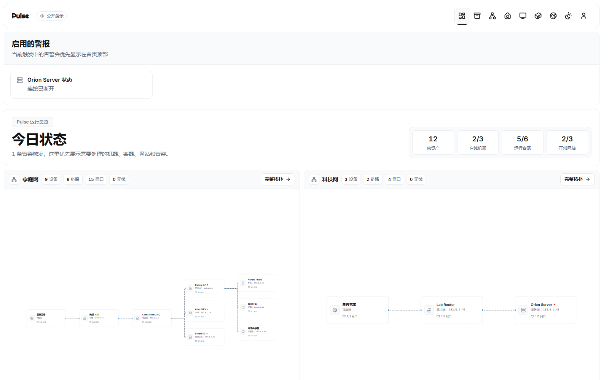
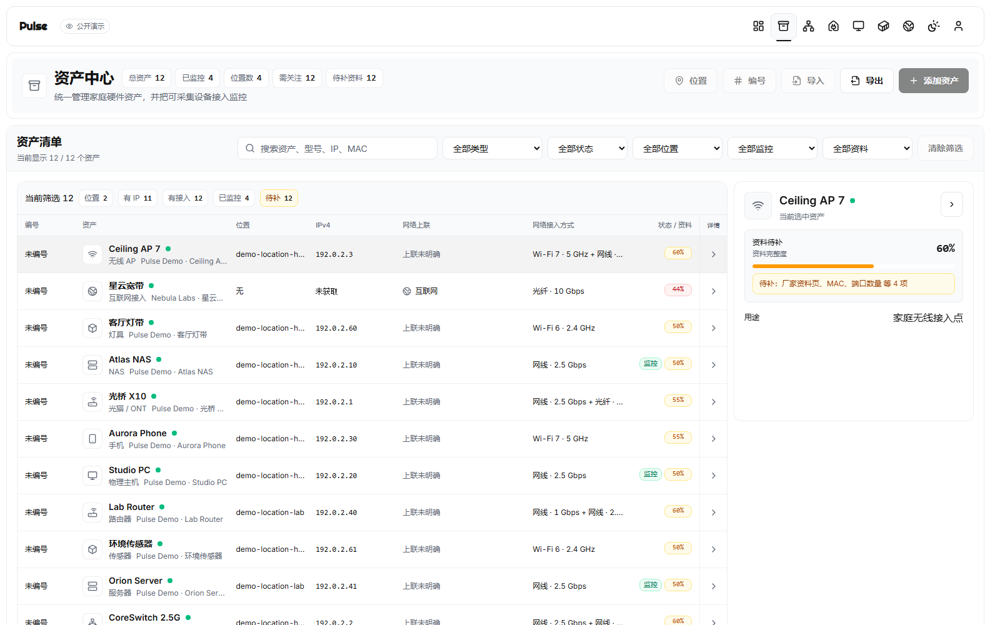
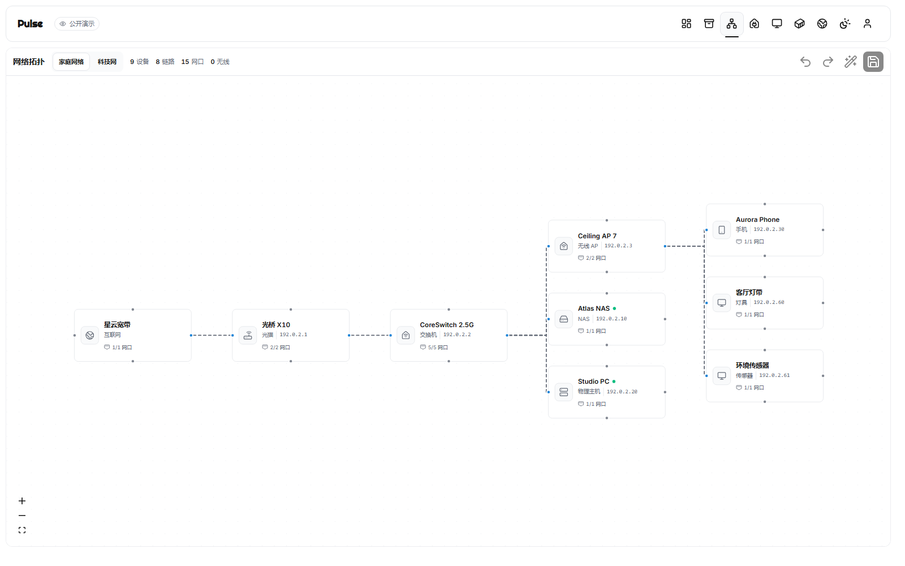
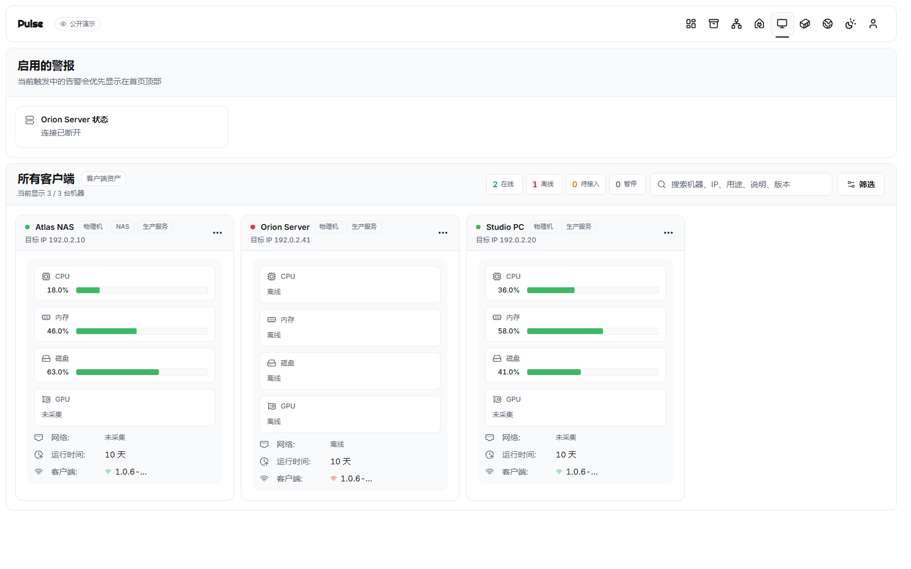

# Pulse

开源的家庭资产、网络拓扑与设备监控平台：用一套可自托管的界面管理设备档案、网络关系、Agent 状态、容器和服务可用性。

[](https://github.com/GuteNachte/pulse/actions/workflows/quality.yml)
[](https://github.com/GuteNachte/pulse/releases/tag/v1.0.6-beta.6)
[](LICENSE)
[](https://pulse-demo-gute-nacht.vercel.app)

[在线演示](https://pulse-demo-gute-nacht.vercel.app) · [下载测试版](https://github.com/GuteNachte/pulse/releases/tag/v1.0.6-beta.6) · [三分钟部署](#三分钟部署) · [English](README.en.md)



| 资产中心 | 家庭网络拓扑 | 客户端监控 |
| --- | --- | --- |
|  |  |  |

> 在线演示使用完全虚构的数据，所有写入操作均被阻止，也不会连接任何真实 Hub、Agent、NAS 或家庭网络。

## 核心能力

- **资产中心**：维护数码硬件、网络设备、智能设备、服务端点及其图片、参数、接口和关系。
- **网络拓扑**：分别梳理家庭网与科技网，支持自动布局、网格吸附、四边连接点和线路分支。
- **设备监控**：通过 Windows 或 Linux / NAS Agent 采集 CPU、内存、磁盘、网络、GPU、温度、S.M.A.R.T.、服务和软件状态。
- **容器与网站**：查看 Docker / Podman 容器状态，监测内外网服务、响应时间和检测历史。
- **告警与审计**：集中处理资源、容器、服务和网站异常，并记录关键管理操作。
- **迁移与备份**：支持资产迁移包与完整实例备份，保留设置、拓扑、附件和设备图片。
- **多端使用**：提供响应式 Web 界面与 Android App，Hub、Agent、Web 和 Android 使用同一显式版本号。

## 三分钟部署

当前公开测试版为 [`v1.0.6-beta.6`](https://github.com/GuteNachte/pulse/releases/tag/v1.0.6-beta.6)。推荐在 Linux、NAS 或飞牛上通过 Docker Compose 部署；公开 Hub 与 Agent 镜像当前以 `amd64` 为主。

```bash
mkdir -p pulse && cd pulse
curl -LO https://github.com/GuteNachte/pulse/releases/download/v1.0.6-beta.6/docker-compose.yml
docker compose pull
docker compose up -d
curl http://127.0.0.1:8090/api/health
```

健康检查成功后，在浏览器打开 `http://你的服务器IP:8090` 创建首个管理员。数据默认保存在当前目录的 `pulse_data`。

> **数据安全：** 升级或重建容器前先备份 `pulse_data`。不要删除该目录，不要执行 `docker compose down -v`，也不要让新容器使用空目录覆盖现有数据。

其他设备接入：

- **Windows**：在“设置 -> Agent 管理”创建配对，再运行页面生成的管理员 PowerShell 安装命令。Release 中的 `.exe` 是 Agent 程序，不是双击安装向导。
- **Linux / NAS / 飞牛**：使用页面生成的 Compose，或下载 Release 中的 `pulse-agent.yml`，填写配对 Token 和目标设备可以访问的 Hub 地址。
- **Android**：下载 Release 中的 `pulse-android-1.0.6-beta.6.apk`，在 App 中填写 Hub 地址。

下载全部附件后可校验完整性：

```bash
sha256sum -c SHA256SUMS
```

完整的公开安装验收见 [docs/public-installation-acceptance.md](docs/public-installation-acceptance.md)，升级与回滚见 [docs/release-deployment-runbook.md](docs/release-deployment-runbook.md)。

## 支持范围与限制

| 组件 | 当前支持 |
| --- | --- |
| Hub | Linux / NAS / 飞牛 Docker，`amd64` |
| Agent | Windows `amd64`；Linux / NAS 容器 `amd64` |
| Web | 当前主流 Chromium、Firefox、Safari |
| Android | Release 提供 APK；与 Hub 使用相同版本号 |

- 当前仍为公开测试版，升级前必须先做可恢复备份。
- Windows Agent 暂无 Authenticode 数字签名，可能触发 SmartScreen。
- 当前不提供 macOS Agent；ARM 镜像和更多 NAS 环境仍需扩大验证范围。
- Pulse 默认不发送产品遥测；网站监控、资料补全等由用户主动配置的外连能力除外。
- 在线演示只用于了解界面，不代表真实 Agent 采集、写入、备份恢复或性能结果。

## 架构

```text
浏览器 / Android App
        |
        v
Pulse Hub (PocketBase + Web + API)
        |
        +---- Windows Agent
        +---- Linux / NAS Agent
        +---- 网站、容器与其他监控目标
```

- **Hub**：负责 Web 管理端、API、资产、拓扑、告警、审计、设置和备份。
- **Agent**：运行在被监控机器上，主动连接 Hub 并采集系统、硬件、容器、服务和软件状态。
- **模块边界**：前端功能按资产中心、网络拓扑、客户端监控、维护等模块组织，新增能力遵循 manifest 与开关语义。

## 本地开发

Windows 可直接运行项目根目录的 `Start-Pulse-Dev.cmd`；脚本会启动或复用 Hub `8090` 与 Vite `5173`，并在健康检查成功后打开页面。Unix 环境和完整开发说明见 [docs/local-dev-runbook.md](docs/local-dev-runbook.md)。

```powershell
npm.cmd --prefix internal/site ci
npm.cmd --prefix internal/site run test
npm.cmd --prefix internal/site run typecheck
npm.cmd --prefix internal/site run build
```

## 路线图

- 扩大 ARM、更多 NAS 和真实家庭网络环境的兼容性验证。
- 持续完善网络拓扑编辑、资产类型模板与设备关系模型。
- 扩充 Agent 采集边界、告警渠道和可观测性，同时保持数据来源可解释。
- 评估 macOS Agent、正式 Windows 代码签名和更稳定的 Android 分发方式。

详细规划见 [docs/pulse-roadmap.md](docs/pulse-roadmap.md)。

## 参与项目

- 使用问题和部署交流：[GitHub Discussions](https://github.com/GuteNachte/pulse/discussions)
- 可复现缺陷：[提交 Issue](https://github.com/GuteNachte/pulse/issues/new/choose)
- 安全问题：[私密报告漏洞](https://github.com/GuteNachte/pulse/security/advisories/new)
- 贡献代码：[CONTRIBUTING.md](CONTRIBUTING.md)
- 支持边界：[SUPPORT.md](SUPPORT.md)
- 行为准则：[CODE_OF_CONDUCT.md](CODE_OF_CONDUCT.md)

提交日志、截图或配置前，请删除 Token、域名、IP、MAC、账号、家庭资产名称和其他私人信息。

## 许可证

Pulse 使用 [MIT License](LICENSE)，并保留上游项目与第三方组件的版权和许可声明，详见 [THIRD_PARTY_NOTICES.md](THIRD_PARTY_NOTICES.md)。
